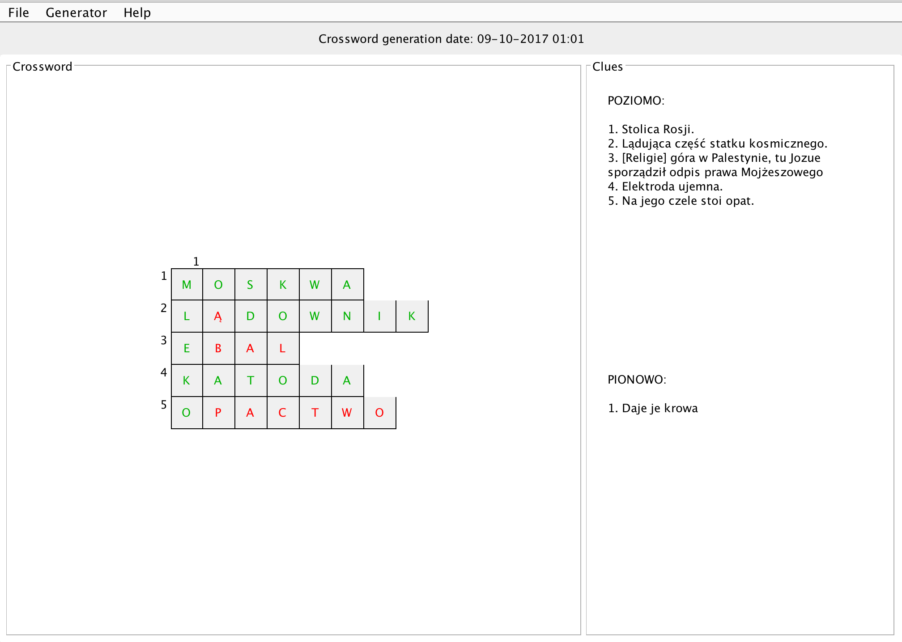

# Maze Solver
Simple GUI application that generates crosswords from a question database. User can solve the crosswords and check the correctness of his solutions.

The application was an assignment in the Object-Oriented Programming course I took at AGH-UST.

