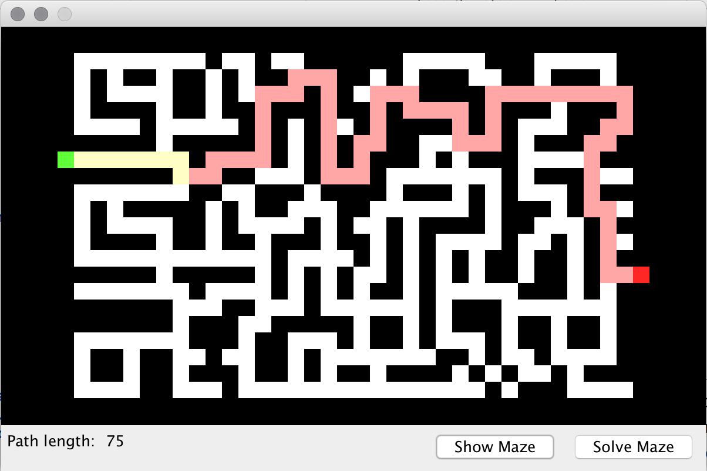

# Maze Solver
Simple GUI application that reads a maze from a text file, finds the shortest path from start to end, and visualizes it.

This application was part of the coursework in the "Object-Oriented Programming" course at the [AGH University of Science and Technology](http://agh.edu.pl/en).

 

